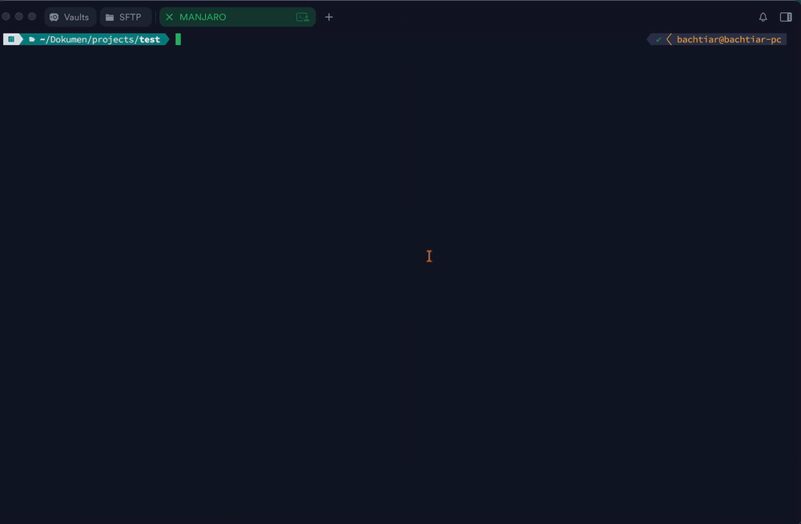

# Ihand TUI — AI Chat in Your Terminal

Chat dengan AI langsung dari terminal. Full-screen TUI dengan real-time streaming, file operations, task plan panel, multi-profile LLM, dan dukungan **OpenAI**, **Anthropic**, **Ollama**, atau provider OpenAI-compatible lainnya (Groq, Together AI, DeepSeek, dll).

 

---

<p align="center">
  
</p>

## Quick Start

### Install (macOS — Homebrew)

```bash
brew tap bachtiarpanjaitan/homebrew-tap
brew trust bachtiarpanjaitan/tap/ihand-tui   # required since Homebrew 4.10+
brew install ihand-tui
```

> **Trust error?** Homebrew 4.10+ mewajibkan trust untuk third-party tap.
> Ganti `brew trust` dengan satu perintah berikut jika gagal:
> ```bash
> export HOMEBREW_NO_REQUIRE_TAP_TRUST=1
> brew install bachtiarpanjaitan/tap/ihand-tui
> ```

### Install (macOS / Linux — curl)

```bash
curl -fsSL https://raw.githubusercontent.com/bachtiarpanjaitan/ihand-tui/master/scripts/install-remote.sh | bash
```

Setelah itu, jalankan dari mana saja:

```bash
ihand
```

### Install (Windows — download binary)

```powershell
# Download langsung .exe dari GitHub Releases (gak perlu Go)
curl -LO https://github.com/bachtiarpanjaitan/ihand-tui/releases/download/v0.1.6/ihand-windows-amd64.exe
mkdir %USERPROFILE%\AppData\Local\ihand 2>nul
move ihand-windows-amd64.exe %USERPROFILE%\AppData\Local\ihand\ihand.exe

# Tambah ke PATH (sekali saja)
setx PATH "%PATH%;%USERPROFILE%\AppData\Local\ihand"

# Jalankan
ihand
```

Atau via PowerShell:

```powershell
# Download + install otomatis
irm https://raw.githubusercontent.com/bachtiarpanjaitan/ihand-tui/master/scripts/install.ps1 | iex
```

> **No dependencies —** Binary siap pakai. Lihat [Install Methods](#install-methods) untuk detail.

---

## Konfigurasi Multi-Profile

Saat pertama dijalankan, `ihand` otomatis membuat file config di lokasi berikut:

| OS | Path |
|----|------|
| macOS | `~/Library/Application Support/ihand/settings.json` |
| Linux | `~/.config/ihand/settings.json` |
| Windows | `%APPDATA%/ihand/settings.json` |

### Format: Multiple LLM Profiles

`ihand` mendukung **multiple LLM profiles** — simpan beberapa konfigurasi LLM dan ganti dari TUI tanpa restart:

```json
{
  "profiles": [
    {
      "name": "Ollama Local",
      "provider": "ollama",
      "model": "llama3.2",
      "api_key": "",
      "base_url": "http://localhost:11434"
    },
    {
      "name": "DeepSeek",
      "provider": "anthropic",
      "model": "claude-sonnet-5",
      "api_key": "sk-ant-...",
      "base_url": "https://api.deepseek.com/anthropic"
    }
  ],
  "active_profile": 0,
  "app": {
    "allowed_dir": ".",
    "session": "default"
  }
}
```

**Backward compatible** — format lama (`llm` flat) otomatis dimigrasi ke format profil saat loading.

### Ganti Profile dari TUI

Ketik `/settings` → pilih **Profile** → Enter → pilih profile lain → Enter → langsung switch (tanpa restart).

### Contoh Provider

#### OpenAI / Compatible

```json
{
  "name": "GPT-4o",
  "provider": "openai",
  "model": "gpt-4o",
  "api_key": "sk-proj-...",
  "base_url": ""
}
```

#### Anthropic (Claude)

```json
{
  "name": "Claude Sonnet",
  "provider": "anthropic",
  "model": "claude-sonnet-5",
  "api_key": "sk-ant-..."
}
```

#### Ollama (local, gratis)

```bash
ollama pull llama3.2
```

```json
{
  "name": "Ollama",
  "provider": "ollama",
  "model": "llama3.2"
}
```

#### OpenAI-compatible (Groq, Together AI, DeepSeek, dll)

```json
{
  "name": "DeepSeek",
  "provider": "anthropic",
  "model": "deepseek-v4-flash",
  "api_key": "sk-...",
  "base_url": "https://api.deepseek.com/anthropic"
}
```

---

## Fitur

### 1. Empat Mode Operasi

Ganti mode kapan saja dengan `Shift+Tab` atau slash command:

| Mode | Command | Perilaku | Tools |
|------|---------|----------|-------|
| 💬 **Chat** | `/chat` | Percakapan normal, baca file & analisis | read-only |
| 📋 **Plan** | `/plan` | Analisis & perencanaan, read-only | read-only |
| ✏️ **Edit** | `/edit` | Implementasi langsung dengan plan checklist + auto-review | read, write, edit, exec |
| 🤖 **Auto** | `/auto` | Otonom penuh, plan → eksekusi → review otomatis | read, write, edit, exec |

#### Mode Edit & Auto — Plan Checklist + Auto-Review

Di mode Edit dan Auto, AI bekerja dengan alur:

```
1. BUAT PLAN → daftar task general dengan [ ] checklist
   - [ ] Setup project (package.json, vite.config, index.html)
   - [ ] Implementasi komponen (Navbar, Hero, Footer)
   
2. EKSEKUSI → SATU task = BANYAK write_file()
   - [x] Setup project
   - [ ] Implementasi komponen
     Action: write_file({"path": "src/Navbar.vue", "content": "..."})
     
3. REVIEW → exec() untuk build/check, otomatis fix error
   Action: exec({"command": "npm run build"})
   
4. SELESAI → Final Answer hanya jika SEMUA task tercentang
```

**Task panel** muncul di atas chatbox menampilkan progres real-time:

```
┌──────────────────────────────────────┐
│ ✓ Setup project                      │
│ ⠋ Implementasi komponen (Navbar...)  │
│ [ ] Tambah styling & layout          │
└──────────────────────────────────────┘
```

Panel maksimal 5 task — prioritaskan yang belum selesai, sisanya `+N lainnya`.

### 2. Effort Level

Atur kedalaman proses AI dengan `/effort`:

| Level | Iterasi | Perilaku |
|-------|---------|----------|
| **Low** | 4 | Jawab singkat, cepat, langsung ke inti |
| **Medium** | 8 | Standar (default) |
| **High** | 24 | Analisis mendalam, edge cases, alternatif solusi |

```bash
/effort high    # langsung set
/effort         # interactive selector
```

### 3. Auto Konfigurasi Project

Saat pertama kali chat dimulai, `ihand` otomatis membaca:
- **Struktur folder** — list_files di root direktori
- **Ekstensi file** — deteksi bahasa pemrograman yang dipakai
- **File konfigurasi** — go.mod, package.json, Cargo.toml, pyproject.toml, dsb

Informasi ini di-inject ke system prompt AI biar langsung paham project tanpa perlu baca manual.

File yang dideteksi:

| Project | File |
|---|---|
| Go | `go.mod` |
| Node.js | `package.json`, `tsconfig.json` |
| Python | `pyproject.toml`, `requirements.txt` |
| Rust | `Cargo.toml` |
| Ruby | `Gemfile` |
| PHP | `composer.json` |
| Java | `pom.xml`, `build.gradle` |
| Umum | `Makefile`, `Dockerfile`, `docker-compose.yml` |

### 4. Slash Commands

Ketik `/` di input — autocomplete muncul. Tekan `Tab` untuk cycling.

| Command | Fungsi |
|---------|--------|
| `/chat` | Mode percakapan normal |
| `/plan` | Mode analisis & rencana (read-only) |
| `/edit` | Mode implementasi & edit file |
| `/auto` | Mode otonom multi-step |
| `/settings` | Ubah pengaturan (profile, provider, model, API key, dll) |
| `/effort` | Set AI thinking effort (low/med/high) |
| `/clear` | Reset percakapan |
| `/stats` | Statistik session (token, pesan, dll) |
| `/help` | Tampilkan bantuan |
| `/self-update` | Update ke versi terbaru |
| `/exit` | Keluar aplikasi |

> **⚠️ `/self-update`:** Jangan jalankan `ihand` dengan `sudo` — fitur ini sudah otomatis meminta sudo jika diperlukan (saat binary di `/usr/local/bin` dll). Cukup jalankan `/self-update` dari dalam TUI, atau dari shell biasa: `ihand` lalu `/self-update`.

### 5. @Mention File & Folder

Ketik `@` di input untuk autocomplete file/folder:

```
▸ tolong baca @chat.go
```

- **Case-insensitive**, prefix match diprioritaskan
- Max 20 hasil, depth 4 level
- Skip: `.git/`, `node_modules/`, `.claude/`, hidden files, file >1MB

### 6. File Operations

AI bisa membaca, menulis, mengedit, dan mengeksekusi file:

| Tool | Fungsi |
|------|--------|
| `write_file` | Buat/timpa file dengan konten lengkap |
| `edit_file` | Search & replace — edit baris spesifik tanpa rewrite seluruh file |
| `read_file` | Baca konten file (max 1MB) |
| `read_file_lines` | Baca baris tertentu dari file |
| `list_files` | List struktur direktori |
| `find_files` | Cari file berdasarkan pattern/glob |
| `search_text` | Cari teks dalam file |
| `create_directory` | Buat direktori baru |
| `exec` | Jalankan command shell (build, test, dll) |

> **Keamanan:** Semua tools dibatasi dalam `allowed_dir`. Path traversal (`../`) ditolak.

### 7. Markdown Rendering

Response AI di-render dengan Glamour — **bold**, `code`, list, tabel, dan syntax highlighting untuk code blocks.

### 8. Real-time Streaming + Spinner

Setiap respon AI tampil real-time:
- **Spinner** `⠋` bergerak selama proses
- **Task panel** update progres checklist
- **Tool calls** muncul langsung saat dieksekusi
- **Final Answer** di-render dengan markdown setelah selesai

---

## Keyboard Shortcuts

| Key | Fungsi |
|-----|--------|
| `Enter` | Kirim pesan |
| `Ctrl+J` / `Shift+Enter` | Baris baru (multiline) |
| `Tab` | Cycling suggestion (command / file) |
| `Shift+Tab` | Ganti mode: Chat → Plan → Edit → Auto |
| `Ctrl+S` | Copy seluruh percakapan ke clipboard |
| `Ctrl+E` | Toggle mouse mode (matikan untuk seleksi teks) |
| `Ctrl+C` / `Ctrl+D` | Keluar |
| `Ctrl+L` | Scroll viewport ke atas |
| `↑` `↓` | Scroll viewport per baris |
| `PgUp` `PgDn` | Scroll viewport per halaman |
| `Home` `End` | Lompat ke awal / akhir viewport |
| `Mouse wheel` | Scroll viewport |
| `Mouse click` | Posisikan kursor di textarea |

> **Copy teks:** Tekan `Ctrl+E` dulu untuk matikan mouse, lalu seleksi normal, atau `Shift+drag` untuk seleksi tanpa matikan mouse.

---

## Settings dari TUI

Ketik `/settings` untuk membuka panel pengaturan:

```
⚙ Pengaturan
────────────────────────────────
  ▸ Profile: DeepSeek
    Provider: anthropic
    Model: claude-sonnet-5
    API Key: ****4f0a
    Base URL: https://api.deepseek.com/anthropic
    Allowed Dir: .
    Session: default
────────────────────────────────
↑↓ navigasi  |  Enter edit (Profile: lihat daftar)
```

Navigasi dengan ↑↓, Enter untuk edit, Esc batal, Ctrl+S simpan.

---

## CLI Flags

| Flag | Default | Fungsi |
|------|---------|--------|
| `--config` | `settings.json` | Path ke file konfigurasi JSON |
| `--version` | — | Tampilkan versi |
| Argumen ke-1 | `.` | Direktori untuk file operations |

```bash
ihand --version                          # → ihand version 1.0.0
ihand --config ~/.config/ihand.json     # config custom
ihand ~/my-project                       # batasi ke folder tertentu
```

---

## Install Methods

### Homebrew (macOS / Linux)

```bash
brew tap bachtiarpanjaitan/homebrew-tap
brew trust bachtiarpanjaitan/tap/ihand-tui   # required since Homebrew 4.10+
brew install ihand-tui
```

**Troubleshooting — trust error:**

```bash
export HOMEBREW_NO_REQUIRE_TAP_TRUST=1
brew install bachtiarpanjaitan/tap/ihand-tui
```

### curl (macOS & Linux)

```bash
curl -fsSL https://raw.githubusercontent.com/bachtiarpanjaitan/ihand-tui/master/scripts/install-remote.sh | bash
```

### make (dari source)

```bash
git clone https://github.com/bachtiarpanjaitan/ihand-tui.git
cd ihand-tui

make install      # build + install ke /usr/local/bin
make build        # build saja (binary: ./ihand)
make build-all    # cross-compile semua platform → dist/
make uninstall    # hapus dari /usr/local/bin
```

### Windows

Download `ihand-windows-amd64.exe` dari [GitHub Releases](https://github.com/bachtiarpanjaitan/ihand-tui/releases).

Atau via PowerShell:

```powershell
irm https://raw.githubusercontent.com/bachtiarpanjaitan/ihand-tui/master/scripts/install.ps1 | iex
```

### Build manual

```bash
git clone https://github.com/bachtiarpanjaitan/ihand-tui.git
cd ihand-tui
go build -o ihand .
./ihand
```

---

## Project Structure

```
ihand-tui/
├── main.go              # Entry point, flag parsing, init
├── model.go             # Data model, types, constructor
├── chat.go              # ReAct loop, tool parsing, system prompts
├── update.go            # Bubble Tea Update, key handling, streaming
├── view.go              # Bubble Tea View, task panel, settings UI
├── conversation.go      # Conversation rendering, markdown
├── settings.go          # Settings mode, profile switching
├── commands.go          # Slash commands & autocomplete
├── helpers.go           # Token counter, file suggestion search
├── styles.go            # Lipgloss style definitions
├── layout.go            # Layout calculation
├── welcome.go           # Welcome message
├── config.go            # JSON config loading, multi-profile
├── selfupdate.go        # Self-update mechanism
├── trust.go             # Directory trust persistence
├── Makefile             # Build, install, cross-compile
├── internal/
│   ├── providers/       # LLM provider implementations
│   │   ├── openai.go
│   │   └── anthropic.go
│   └── tools/           # File operation tools
│       ├── tools.go     # ReadFile, WriteFile, EditFile, ListFiles, dll
│       ├── browse.go    # Web browsing
│       └── exec.go      # Shell command execution
├── settings.json        # Konfigurasi (user-specific)
└── go.mod
```

---

## Uninstall

```bash
# macOS / Linux
sudo rm /usr/local/bin/ihand

# Windows
rm -r %USERPROFILE%\AppData\Local\ihand
```

---

## License

MIT
